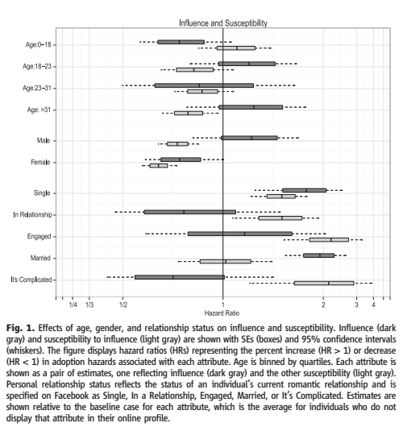
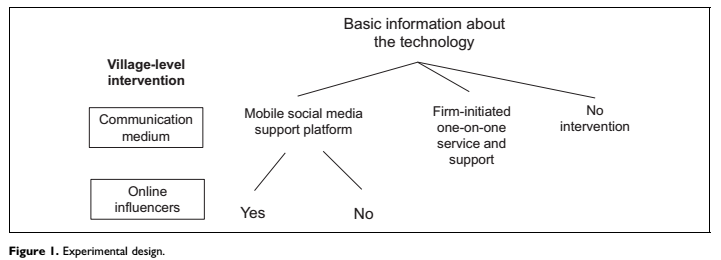
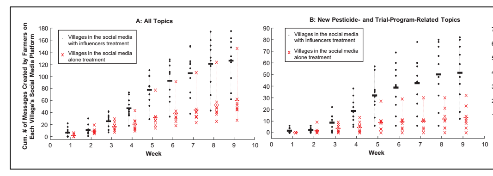
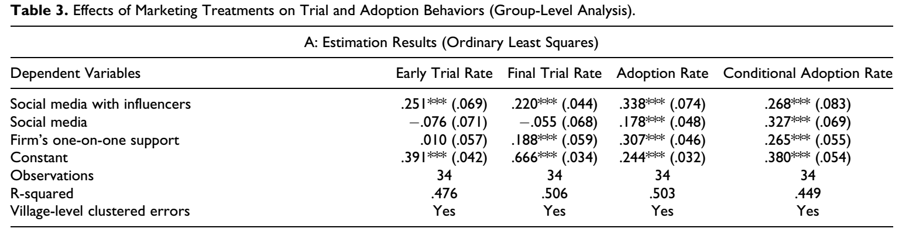
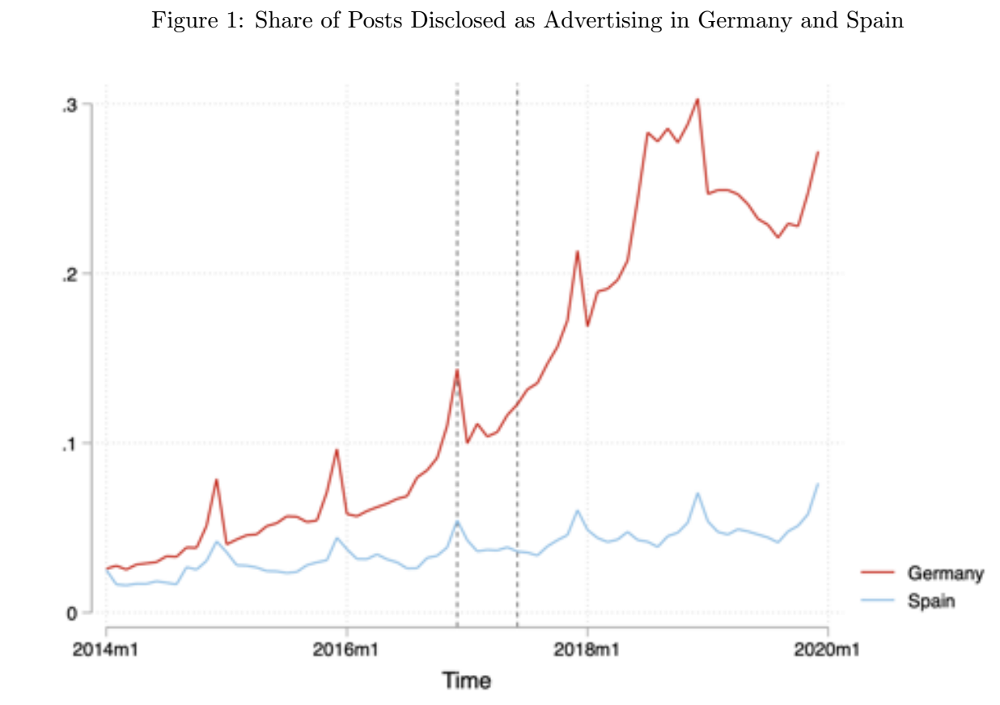
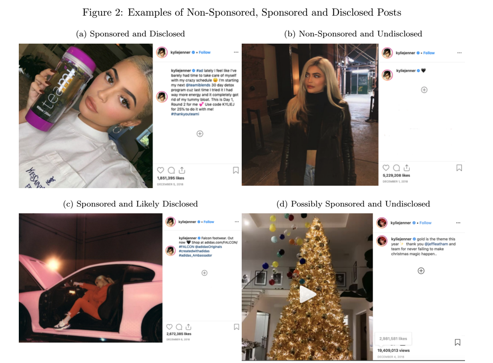
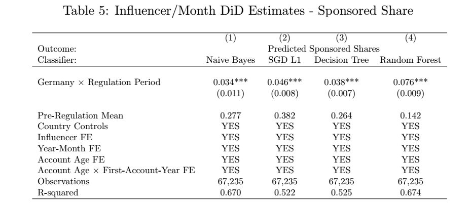
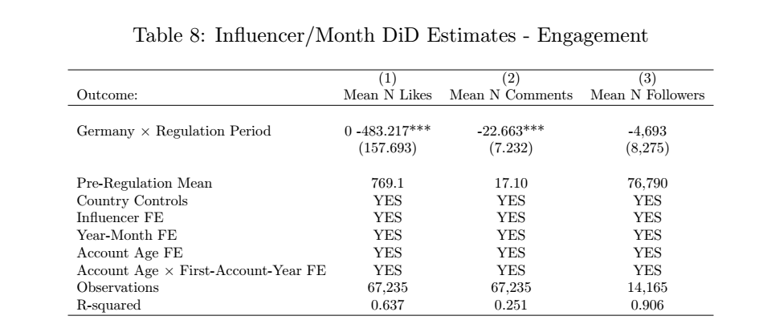

class: font200

# Learning Goals for this Week

* Define the term influencer marketing
* Explain stylized facts around the influencer marketplace
* Identify challenges in identifying organic influencers and susceptible types 
* Assess when and how influencers might impact consumer's purchase patterns
* Explain the effects of increased regulation on consumer engagement with influencers

---
class: inverse, center, middle

# The Influncer Marketplace

---
class: font160
# What is Influencer Marketing?

> **Influencer Marketing**: A type of social media marketing that uses endorsements and product mentions from influencers

Who are influencers? Someone who has:

* Power to affect the purchasing decisions of others because of his or her authority, knowledge, position, or relationship with his or her audience
* A following in a distinct niche, with whom he or she actively engages

Types of influencers:

* How niche they are 
* How large there reach is: mega, macro, micro, nano 

---
class: font130
# The Influencer Market 

**Stylized Facts**:

* Large and growing, approx 9.7 billion USD in 2020
  * 2016: 1.7 billion USD, 2025: (expected) > 20 billion USD

* Approx. 3/4 companies use influencer marketing to some extent, mainly Instagram
  * Only 65% of those who use it, track ROI

* Becoming 'centralized' thorugh influencer marketing agencies 
  * Interesting incentive problems here...

* Large growth in the use of "micro" influencers 

* Growing concern: compliance issues
  * Only approx 20% of (US/UK) posts meet regulatory guidelines

<!--- 
borrowed roughly from here https://influencermarketinghub.com/influencer-marketing-benchmark-report-2020/
--->

---
class: font160
# Today's Agenda 

Three papers:

* [Identifying Influential and Susceptible Members of Social Networks][aral]
  * Aral and Walker (2012, Science)
* [Social Media, Influencers, and Adoption of an Eco-Friendly Product: Field Experiment Evidence from Rural China][zhang]
  * Zhang, Chintagunta & Kalwani (2021, Journal of Marketing)
* [The Effects of Influencer Advertising Disclosure Regulations: Evidence From Instagram][ershov]
  * Ershov & Mitchell (2021, Working Paper)

[aral]: https://static1.squarespace.com/static/5e680023bf798b61525c7831/t/5ed0fc2daa179d0d0a3bf5ed/1590754350409/identifying-influential-and-susceptible-members-of-social-networks.pdf
[zhang]: https://journals.sagepub.com/doi/pdf/10.1177/0022242920985784
[ershov]: https://www.dropbox.com/s/c6qn4us6gugwqqi/Influencers_ACM_EC_Website.pdf?dl=0

---
class: inverse, center, middle

# Identifying Influential and Susceptible Members of Social Networks

---
class: font160
# Influence and Susceptibility

**Motivation**: How does behavior spread through a social network?

**Specific Questions**:

* Who is susceptible to influence?
* Who can be influential?

**How?**: Randomized experiment on Facebook

---
class: font160
# The Experiment

* Sample: representative sample of 1.3 million users

* Treatment: Manipulation of influence-mediating messages (about films)
  * If "user A" adopted an app allowing info/opinion sharing ...
  * ... random selection of friends where notified ...
  * ... and got a link to adopt the application  

* Outcome variable: Time to peer adoption
  * $\implies$ estimate a hazard model 
  * Hazard ratio > 1 increased susceptiblity / influence

**Note: The design is nice...**

---
# Results: Influence and Susceptibility

```{r, echo = FALSE, fig.align = "center", out.width="65%"}

```

---
class: font140
# Takeaways?

**Most susceptible to influence:**

* Younger people (0-18)
* Men
* People who are engaged

**More influential:**

* Men 
* Older
* Married

**Question: Are these variables capturing something unobserved?**

I think the answer is yes... 

* These groups feel artificial, and likely capturing something related to interests

---
class: inverse, center, middle

# Social Media, Influencers, and Adoption


---
class: font160
# Social Media, Influencers, and Adoption

**Motivation**: Quantifying the effect of influencers (and social media) on product adoption

**Specific Questions**:

* Do influencers facilitate product adoption? When?
* What's the mechanism through which it happens?

**How?**: Randomized Control Trial in rural China

---
class: font160
# The Experiment

* Product: nano-pesticide

* Sample: approx 700 farmers across 34 villages

* Two Treatments: 
  * Online discussion group on WeChat per village 
  * Add eminent local personalities 
    * "peer encouragment design"

* Outcome variables:
  * Farmers trial a product
  * Adoption

---
# The Experiment as a Graph

```{r, echo = FALSE, fig.align = "center", out.width="100%"}

```

---
# Influencers & Interactions


```{r, echo = FALSE, fig.align = "center", out.width="110%"}

```

.center[Influencers lead to more discussion in online discussion platform]

---
# Trial and Adoption

```{r, echo = FALSE, fig.align = "center", out.width="120%"}

```

**Findings**

* Influencers $\rightarrow$ early trial
* Influencers and one-on-one support $\rightarrow$ similar adoption rates
  * Big cost difference!

**Mechanisms?**

* Encouragement to try the product 
  * Building trust + eliminating uncertainty about product and company

---
class: inverse, center, middle

# Effects of Influencer Advertising Disclosure Regulations


---
class: font160
# Influencers as Advertisers

**Motivation**: Concern and growing regulation around hidden sponsorship

**Specific Question**:

* What to advertising disclosure regulations do to content engagement?

**How?**: Natural Experiment on Instagram

---
class: font160
# The Experiment

The 'Experiment': Introduction of strict Ad Disclosure Laws

* **Treatment**: New laws passed in Germany in late 2016
* **Treated Group**: Germany influencer market
* **Untreated Group**: Spanish influencer market

Data: 6,000 local influencers in Spain and Germany

---
# Disclosure Patterns

```{r, echo = FALSE, fig.align = "center", out.width="85%"}

```

---
# Detecting Disclosure?

```{r, echo = FALSE, fig.align = "center", out.width="85%"}

```

---
# Disclosure Before & After


```{r, echo = FALSE, fig.align = "center", out.width="110%"}

```

---
# Engagement Metrics


```{r, echo = FALSE, fig.align = "center", out.width="110%"}

```

---
class: inverse, center, middle

# Recap

---
class: font160
# Recap

* Influencer market is large, mostly 'unregulated' 

* Hard to generally classify people as susceptible to influencers or organically 'likely' influential 

* Influencers lead to increased early adoption & can be generate good ROI 

* Growing push for regulation $\rightarrow$ consumer's engagement with influencers decreases

---
# License & Citation

Suggested Citation:

```{r, engine='out', eval = FALSE}
@misc{smwa_2021_l05,
      title={"Social Media and Web Analytics: Lecture 5"},
      author={Lachlan Deer},
      year={2021},
      url = "https://github.com/tisem-digital-marketing/smwa-lecture-05"
}
```

<p style="text-align:center;"></p>

This course adheres to the principles of the Open Science Community of Tilburg University. 
This initiative advocates for transparency and accessibility in research and teaching to all levels of society and thus creating more accountability and impact.

<p style="text-align:center;"></p>
This work is licensed under a <a rel="license" href="http://creativecommons.org/licenses/by-sa/4.0/">Creative Commons Attribution-ShareAlike 4.0 International License</a>.